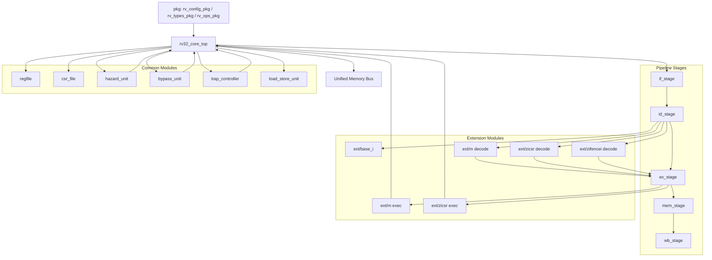

# RV32I Simulation Workspace

This directory holds the simulation-first RISC-V softcore flow:

- `../../rtl/rv32i/rv32i_core.sv`: 5-stage in-order RV32I core with machine-mode traps and a unified memory port
- `rv32i_system.sv`: simulation wrapper with 64 KiB RAM and `tohost` / `fromhost` MMIO
- `tb_top.cpp`: Verilator harness
- `build-program.sh`: cross-compiles a test into ELF, binary, objdump, and hex
- `run-sim.sh`: builds and runs the Verilator simulation on a hex image
- `run-directed-tests.sh`: builds and runs the included directed assembly tests

Memory map:

- reset PC: `0x80000000`
- RAM: `0x80000000` .. `0x8000ffff`
- `tohost`: `0x8000fff8`
- `fromhost`: `0x8000fffc`

Pass / fail convention:

- `tohost == 1`: pass
- any other nonzero `tohost`: fail code

## Planned Module Structure

The current core is still a single main RTL module, but the intended refactor target is a more modular structure that separates pipeline-stage logic from extension logic.

Planned directory layout:

- `rtl/rv32i/pkg`
- `rtl/rv32i/core`
- `rtl/rv32i/stages`
- `rtl/rv32i/common`
- `rtl/rv32i/ext/base_i`
- `rtl/rv32i/ext/m`
- `rtl/rv32i/ext/zicsr`
- `rtl/rv32i/ext/zifencei`

Planned module roles:

- `rv32_core_top`: owns the PC, pipeline registers, stall/flush behavior, bypassing, hazards, and extension arbitration
- `if_stage`, `id_stage`, `ex_stage`, `mem_stage`, `wb_stage`: mostly combinational stage-local logic
- `regfile`, `csr_file`, `hazard_unit`, `bypass_unit`, `trap_controller`, `load_store_unit`: shared common blocks used by the pipeline shell and stages
- extension modules: split into decode hooks and execute hooks so new ISA features do not sprawl into the entire core



## Extension Model

The extension structure is intended to be compile-time configurable, not driven by preprocessor sprawl or runtime masking.

- feature selection is intended to live in a single compile-time config struct from a shared package
- each extension provides a sub-decoder and, when needed, an execute-side unit
- disabled extensions should decode as illegal instructions
- enabled extensions should flow through the same trap, redirect, and writeback machinery as the base ISA
- multi-cycle extensions such as `M` should stall the pipeline through the top-level core rather than owning their own local pipeline control

Planned interface direction:

- the unified memory bus remains the stable public core interface
- stage-to-stage communication is intended to move to typed records defined in package files
- extension plug-ins are intended to exchange decode and execute response records with the pipeline shell

## Why This Structure

This split is intended to make the core easier to grow without losing control over behavior.

- it keeps the public memory interface stable while the internal organization evolves
- it improves stage-level readability without scattering stall/flush control across many modules
- it makes extension verification easier by letting the same core be tested in multiple feature configurations

## Verification Direction

Directed tests should eventually be run across multiple feature builds, not just one default configuration.

Planned configuration matrix:

- `RV32I`
- `RV32I+M`
- later `RV32I+Zicsr+Zifencei`

That means disabled-extension instructions should trap as illegal, while enabled ones should execute through the shared pipeline machinery.

Typical flow:

```sh
sim/rv32i/build-program.sh sim/rv32i/tests/basic.S
sim/rv32i/run-sim.sh sim/rv32i/build/basic.hex sim/rv32i/build/basic.fst 20000
sim/rv32i/run-directed-tests.sh
```
